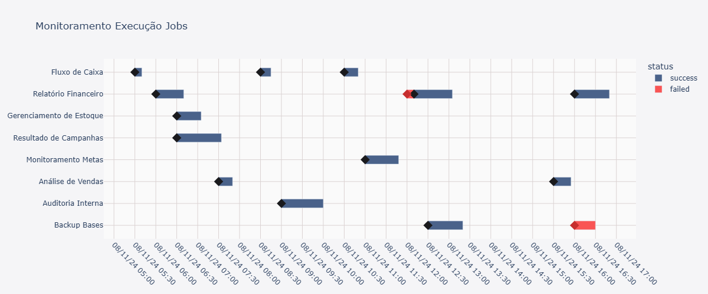

# Gráfico monitoramento jobs

Esse gráfico foi a forma mais fácil que encontrei para monitorar a execução de jobs. Foi gerado com o Plotly, uma biblioteca de visualização de dados em Python que gera diferentes tipos de visuais interativos. 

No script os jobs são agrupados por nome, na mesma linha são exibidas todas as execuções, as barras são geradas com base na duração e hora de início de cada tarefa.

 